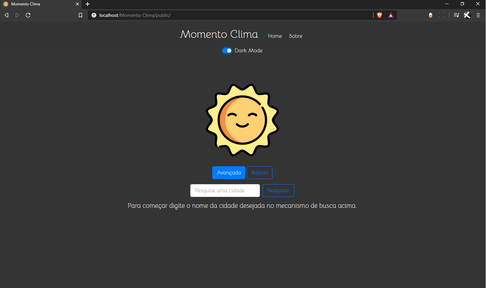
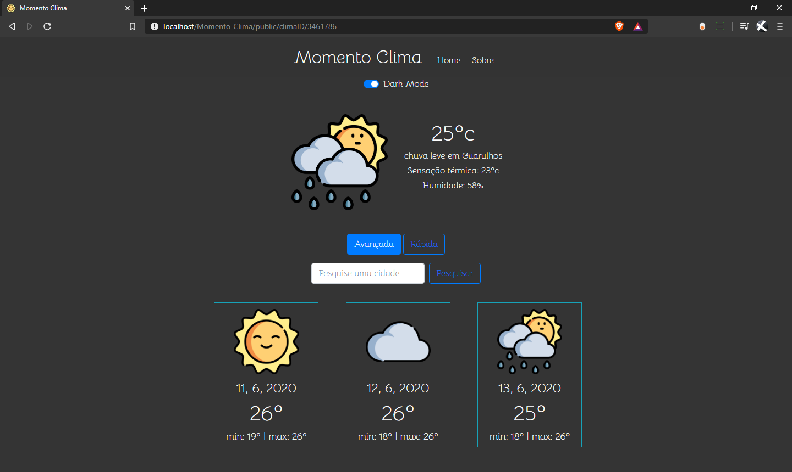

## Momento Clima

Momento Clima é um projeto pessoal de um website focado em trazer a previsão do tempo de milhares de cidades espalhadas pelo mundo de maneira fácil e intuitiva.

## O que foi utilizado

- **[HTML]**
- **[CSS]**
- **[PHP]**
- **[Laravel]**
- **[JavaScript]**
- **[Bootstrap]**

## Screenshots
####Light Mode
 

#### Dark Mode

## Devidos créditos

Desenvolvedor: Jessé Carvalho (jesseelias80@gmail.com).  
[Icons cedidos gratuitamente por: Freepik](https://www.flaticon.com/authors/freepik).  
API de autoria de [Open Weather Map](https://openweathermap.org/api).

## Licença

MIT
